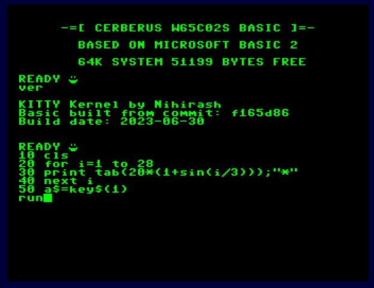

# Cerberus W65C02S Basic



Based on Microsoft Basic for 6502. Forked from [this repo](http://github.com/mist64/msbasic).

It's early in progress and not tested on real hardware. 

This sources tree targets only to Cerberus 2100(and possibly 2080) computers. 

I'm standing on shoulders of titans. Some code possibly acquired from public resources.

## Extensions

## Core

 * Tokens name table extended to 512 bytes(was 256 before).

 * RAM test will check memory from `RAMSTART2` up to `RAMEND`. 

 * Token table was extended. My article about [this modification](https://nihirash.net/posts/extending-token-table-msbasic6502/)

### Terminal extensions

 * **KEY$(n)** function - reads key if zero - non blocking. For example
```
    10 A$=KEY$(0)
    20 IF A$="" THEN GOTO 10
    30 PRINT "YOU PRESSED: "; A$
```
or
```
    10 PRINT "YOU PRESSED: ";KEY$(1)
```

Letters will be always uppercased.

 * **CLS** - clear screen

 * **LOCATE COL, ROW** - move cursor to specified point. Example:

 ```
    10 CLS
    20 LOCATE 10,10
    30 PRINT "Hello!"
 ```
 * Updated command **POS(n)**, when N is zero will be returned current COL else ROW. Example:
 ```
    10 LOCATE 13, 11
    20 x = POS(1) : y = POS(0)
    30 CLS
    50 PRINT "X=";STR$(x);" Y=";STR$(y)
 ```

### Low resolution graphics

 * **PSET X, Y** - draw low resolution graphics point.

 * **LINE x1,y1,x2,y2** - draw line connecting two specified points

 * **CIRCLE x,y,r** - draw circle with center at X,Y and raduis R

## Tile graphics

User defined graphics that allows use 45(from 1 to 45, zero is empty tile) tiles on screen.

 * **TILEDEF n,b1,b2,b3,b4,b5,b6,b7,b8** - define tile with number N and bitmap bytes specified by b1..b8

 * **TILE x,y,n** - draw tile N with coordinates X and Y

## Development

[CC65 compiler suite](https://cc65.github.io) is required.

`make.sh` build script will make everything that required for building version. 

## Included font

I've designed font for usage with Cerberus basic:


It have same license that my code - 2-clause BSD. 

Feel free to use it in your projects.

## More Information about Microsoft Basic

More information on the differences of the respective versions can be found on this blog entry: [Create your own Version of Microsoft BASIC for 6502](http://www.pagetable.com/?p=46).

## License

2-clause BSD