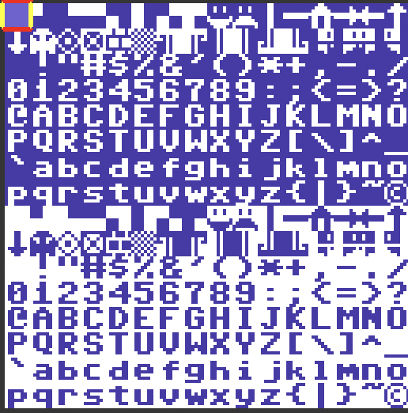

# Cerberus W65C02S Basic

Based on Microsoft Basic for 6502. Forked from [this repo](http://github.com/mist64/msbasic).

It's early in progress and not tested on real hardware. 

I'm cleaning up sources from useless branches of conditional build and making it usable on
Cerebrus 2080 and Cerebrus 2100 computers.

## Extensions

 * KEY$(n) function - reads key if zero - non blocking. For example
```
    10 A$=KEY$(0)
    20 IF A$="" THEN GOTO 10
    30 PRINT "YOU PRESSED: "; A$
```
or
```
    10 PRINT "YOU PRESSED: ";KEY$(1)
```

Letters will be always uppercased.

 * CLS - clear screen

## Included font

I've designed font for usage with Cerberus basic:



It have same license that my code - 2-clause BSD. 

Feel free to use it in your projects.

## More Information about Microsoft Basic

More information on the differences of the respective versions can be found on this blog entry: [Create your own Version of Microsoft BASIC for 6502](http://www.pagetable.com/?p=46).

## License

2-clause BSD